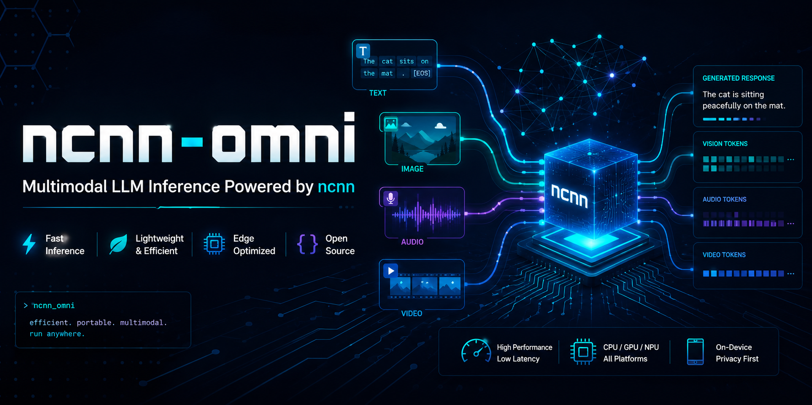

<p align="center">
  
</p>

[](LICENSE) [](README_CN.md) [](https://huggingface.co/songqiuyu)

# ncnn-omni

ncnn-omni is an early-stage, lightweight C++ runtime for on-device multimodal
model inference using [ncnn](https://github.com/Tencent/ncnn) as the tensor graph
backend.

The project is designed for phones, PCs, and embedded devices. Its architecture
supports different model topologies instead of treating every multimodal model as
a vision extension of a text LLM. Initial architecture-validation targets are
Qwen3-ASR, a Qwen VLM, and Qwen3-TTS.

## Current status

The project is in the design/scaffolding phase. No stable public API or runnable
inference library is claimed yet.

- [Design document index](docs/README.md)
- [Architecture overview](docs/architecture/overview.md)
- [Inference engine survey](docs/research/inference-engine-survey.md)
- [Model package proposal](docs/architecture/model-package.md)
- [Implementation roadmap](docs/roadmap.md)

## Proposed structure

```text
include/ncnn_omni/   public C++ contracts
src/core/            engine, session, resources
src/runtime/ncnn/    ncnn-only execution adapter
src/pipeline/        stages, topology, queues, schedulers
src/processors/      text, image, and audio processing
src/generation/      text and audio generation engines
src/models/          model-family adapters
bindings/            C and platform-language bindings
tools/               conversion, inspection, benchmarking
tests/               unit, integration, and parity tests
```

Implementation starts with a CPU Qwen3-ASR vertical slice. Public interfaces stay
experimental until ASR, VLM, and streaming TTS validate the shared abstractions.
